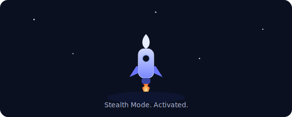

# Students Hub - Stealth Frontend Project 

An international study planning platform that helps students discover universities, explore courses, and build learning agreements with AI-powered guidance.

## Project info

**URL**: https://lovable.dev/projects/9a1bc962-3c20-4c50-97f3-605b5e43d674

## Code line count 🧮 

<!-- LOC_START -->
**Stealth Total Lines of Code:** 36871
<!-- LOC_END -->

## 📁 Project Structure

```
StealthFrontend/
├── bun.lockb                    # Bun package manager lock file
├── components.json              # shadcn/ui component library configuration
├── eslint.config.js             # ESLint linting rules
├── index.html                   # HTML entry point with meta tags and root div
├── package.json                 # Project dependencies, scripts, and metadata
├── postcss.config.js            # PostCSS configuration for Tailwind
├── README.md                    # Project documentation
├── tailwind.config.ts           # Tailwind CSS configuration
├── tsconfig.app.json            # App-specific TypeScript settings
├── tsconfig.json                # Root TypeScript configuration
├── tsconfig.node.json           # Node-specific TypeScript settings
├── vite.config.ts               # Vite bundler configuration with React SWC plugin
│
├── public/
│   └── robots.txt               # Search engine crawler rules
│
├── src/
│   ├── App.tsx                  # Root component with routing, providers, and layout
│   ├── index.css                # Global styles, CSS variables, Tailwind imports
│   ├── main.tsx                 # Application entry point - renders <App /> to DOM
│   ├── vite-env.d.ts            # Vite TypeScript type declarations
│   │
│   ├── assets/                  # Static assets (images, icons, etc.)
│   │
│   ├── components/
│   │   ├── Footer.tsx           # Site footer - Links organized by Product, Resources, Legal
│   │   ├── Header.tsx           # Navigation header - Logo, nav links, user dropdown, mobile menu
│   │   ├── NavLink.tsx          # Reusable navigation link component
│   │   ├── UniversityMap.tsx    # Map visualization for university locations
│   │   │
│   │   └── ui/                  # shadcn/ui pre-built accessible components
│   │       ├── accordion.tsx    # Expandable content sections
│   │       ├── alert-dialog.tsx # Confirmation dialogs
│   │       ├── alert.tsx        # Alert messages
│   │       ├── aspect-ratio.tsx # Aspect ratio containers
│   │       ├── avatar.tsx       # User avatars
│   │       ├── badge.tsx        # Status badges
│   │       ├── breadcrumb.tsx   # Navigation breadcrumbs
│   │       ├── button.tsx       # Button variants
│   │       ├── calendar.tsx     # Date picker calendar
│   │       ├── card.tsx         # Card layouts
│   │       ├── carousel.tsx     # Image/content carousels
│   │       ├── chart.tsx        # Data visualization charts
│   │       ├── checkbox.tsx     # Checkbox inputs
│   │       ├── collapsible.tsx  # Collapsible sections
│   │       ├── command.tsx      # Command palette
│   │       ├── context-menu.tsx # Right-click context menus
│   │       ├── dialog.tsx       # Modal dialogs
│   │       ├── drawer.tsx       # Mobile-friendly drawers
│   │       ├── dropdown-menu.tsx # Dropdown menus
│   │       ├── form.tsx         # Form field wrappers with validation
│   │       ├── hover-card.tsx   # Hover preview cards
│   │       ├── input-otp.tsx    # OTP input fields
│   │       ├── input.tsx        # Text input fields
│   │       ├── label.tsx        # Form labels
│   │       ├── menubar.tsx      # Menu bar navigation
│   │       ├── navigation-menu.tsx # Navigation menus
│   │       ├── pagination.tsx   # Pagination controls
│   │       ├── popover.tsx      # Popover tooltips
│   │       ├── progress.tsx     # Progress bars
│   │       ├── radio-group.tsx  # Radio button groups
│   │       ├── resizable.tsx    # Resizable panels
│   │       ├── scroll-area.tsx  # Custom scrollable areas
│   │       ├── select.tsx       # Select dropdowns
│   │       ├── separator.tsx    # Visual separators
│   │       ├── sheet.tsx        # Slide-out panels
│   │       ├── sidebar.tsx      # Sidebar navigation
│   │       ├── skeleton.tsx     # Loading skeletons
│   │       ├── slider.tsx       # Range sliders
│   │       ├── sonner.tsx       # Toast notifications (Sonner)
│   │       ├── switch.tsx       # Toggle switches
│   │       ├── table.tsx        # Data tables
│   │       ├── tabs.tsx         # Tab navigation
│   │       ├── textarea.tsx     # Multiline text inputs
│   │       ├── toast.tsx        # Toast notifications
│   │       ├── toaster.tsx      # Toast container
│   │       ├── toggle-group.tsx # Toggle button groups
│   │       ├── toggle.tsx       # Toggle buttons
│   │       └── tooltip.tsx      # Tooltips
│   │
│   ├── contexts/
│   │   └── AuthContext.tsx      # Authentication context - User state, sign in/out, session management
│   │
│   ├── hooks/
│   │   ├── use-mobile.tsx       # Detect mobile viewport
│   │   ├── use-toast.ts         # Toast notification hook
│   │   ├── useAI.ts             # AI features (advisor, recommendations, email drafts)
│   │   ├── useCourseReviews.ts  # Course review system CRUD
│   │   ├── useCourses.ts        # Fetch/filter courses data
│   │   ├── useEmailDrafts.ts    # Email drafts management
│   │   ├── useLabs.ts           # Fetch research labs data
│   │   ├── useLearningAgreements.ts # CRUD for learning agreements
│   │   ├── usePrograms.ts       # Fetch academic programs
│   │   ├── useSavedItems.ts     # Manage saved courses/labs/programs
│   │   ├── useTeachers.ts       # Fetch faculty data
│   │   ├── useUniversities.ts   # Fetch universities data
│   │   └── useUniversityMedia.ts # University media/images
│   │
│   ├── integrations/
│   │   └── supabase/            # Supabase client configuration and API integrations
│   │
│   ├── lib/
│   │   └── utils.ts             # Utility functions (cn() for className merging)
│   │
│   └── pages/
│       ├── AIAdvisor.tsx        # AI chat interface - Conversational study advisor
│       ├── Auth.tsx             # Authentication - Sign in/sign up forms with tabs
│       ├── CourseDetail.tsx     # Single course - Info, topics, teacher, reviews system
│       ├── Courses.tsx          # Course catalog - Search, filter, save courses
│       ├── EmailDrafts.tsx      # Email drafts manager - AI-generated professional emails
│       ├── Index.tsx            # Homepage - Hero section, features, statistics, CTA
│       ├── LabDetail.tsx        # Single lab - Description, research topics, PIs
│       ├── Labs.tsx             # Research labs listing
│       ├── LearningAgreementDetail.tsx # Learning agreement view/edit
│       ├── NotFound.tsx         # 404 page
│       ├── Profile.tsx          # User profile - Saved items, AI recommendations, agreements
│       ├── ProgramDetail.tsx    # Single program - Curriculum details by year
│       ├── Programs.tsx         # Academic programs listing
│       ├── Statistics.tsx       # Platform statistics overview
│       ├── TeacherDetail.tsx    # Single teacher - Profile, h-index, citations, courses
│       ├── Teachers.tsx         # Faculty listing
│       ├── Universities.tsx     # University listing - Browse and filter
│       └── UniversityDetail.tsx # Single university - Details, courses, labs, faculty
│
└── supabase/
    ├── config.toml              # Supabase project configuration
    │
    ├── functions/
    │   ├── ai-course-recommendations/
    │   │   └── index.ts         # Edge Function - AI course recommendations
    │   ├── ai-email-draft/
    │   │   └── index.ts         # Edge Function - Generate professional email drafts
    │   └── ai-study-advisor/
    │       └── index.ts         # Edge Function - AI chat advisor using Gemini
    │
    └── migrations/              # Database migration files
        ├── 20251129165717_*.sql
        ├── 20251129165802_*.sql
        └── 20251129172048_*.sql
```

---

## 📄 File Responsibilities

### Root Configuration Files

| File | Responsibility |
|------|----------------|
| `package.json` | Project dependencies, scripts (`dev`, `build`, `lint`, `preview`), and metadata |
| `vite.config.ts` | Vite bundler configuration with React SWC plugin and path aliases |
| `tailwind.config.ts` | Tailwind CSS configuration |
| `tsconfig.json` | Root TypeScript configuration |
| `tsconfig.app.json` | App-specific TypeScript settings |
| `tsconfig.node.json` | Node-specific TypeScript settings |
| `components.json` | shadcn/ui component library configuration |
| `postcss.config.js` | PostCSS configuration for Tailwind |
| `eslint.config.js` | ESLint linting rules |
| `index.html` | HTML entry point with meta tags and root div |

### Entry Points (`src/`)

| File | Responsibility |
|------|----------------|
| `src/main.tsx` | Application entry point - renders `<App />` to DOM |
| `src/App.tsx` | Root component with routing, providers (React Query, Auth, Tooltips), and layout structure |
| `src/index.css` | Global styles, CSS variables (design system), and Tailwind imports |
| `src/vite-env.d.ts` | Vite TypeScript type declarations |

### Pages (`src/pages/`)

| File | Responsibility |
|------|----------------|
| `Index.tsx` | **Homepage** - Hero section, features overview, statistics, and CTA |
| `Auth.tsx` | **Authentication** - Sign in/sign up forms with tabs |
| `Profile.tsx` | **User profile** - Saved courses, labs, programs, AI recommendations, learning agreements |
| `Statistics.tsx` | **Platform statistics** - Overview of universities, courses, labs data |
| `Universities.tsx` | **University listing** - Browse and filter universities |
| `UniversityDetail.tsx` | **Single university** - Details, courses, labs, faculty, campus photos |
| `Programs.tsx` | **Academic programs listing** |
| `ProgramDetail.tsx` | **Single program** - Curriculum details with accordion by year |
| `Courses.tsx` | **Course catalog** - Search, filter, save courses |
| `CourseDetail.tsx` | **Single course** - Info, topics, teacher, reviews system |
| `Teachers.tsx` | **Faculty listing** |
| `TeacherDetail.tsx` | **Single teacher** - Profile, h-index, citations, courses taught |
| `Labs.tsx` | **Research labs listing** |
| `LabDetail.tsx` | **Single lab** - Description, research topics, PIs, affiliated universities |
| `AIAdvisor.tsx` | **AI chat interface** - Conversational study advisor |
| `EmailDrafts.tsx` | **Email drafts manager** - AI-generated professional email drafts |
| `LearningAgreementDetail.tsx` | **Learning agreement view/edit** |
| `NotFound.tsx` | **404 page** |

### Components (`src/components/`)

| File | Responsibility |
|------|----------------|
| `Header.tsx` | **Navigation header** - Logo, nav links, user dropdown, mobile menu |
| `Footer.tsx` | **Site footer** - Links organized by Product, Resources, Legal |
| `NavLink.tsx` | Reusable navigation link component |
| `UniversityMap.tsx` | Map visualization for university locations |

### Contexts (`src/contexts/`)

| File | Responsibility |
|------|----------------|
| `AuthContext.tsx` | **Authentication context** - User state, sign in/out, session management via Supabase |

### Hooks (`src/hooks/`)

| File | Responsibility |
|------|----------------|
| `use-mobile.tsx` | Detect mobile viewport |
| `use-toast.ts` | Toast notification hook |
| `useUniversities.ts` | Fetch universities data |
| `useCourses.ts` | Fetch/filter courses |
| `usePrograms.ts` | Fetch programs |
| `useLabs.ts` | Fetch research labs |
| `useTeachers.ts` | Fetch faculty data |
| `useSavedItems.ts` | Manage saved courses/labs/programs |
| `useLearningAgreements.ts` | CRUD for learning agreements |
| `useCourseReviews.ts` | Course review system |
| `useAI.ts` | AI features (advisor, recommendations, email drafts) |
| `useEmailDrafts.ts` | Email drafts management |
| `useUniversityMedia.ts` | University media/images |

### Supabase Backend (`supabase/`)

| File | Responsibility |
|------|----------------|
| `config.toml` | Supabase project configuration |
| `functions/ai-study-advisor/index.ts` | **Edge Function** - AI chat advisor using Gemini |
| `functions/ai-email-draft/index.ts` | **Edge Function** - Generate professional email drafts |
| `functions/ai-course-recommendations/index.ts` | **Edge Function** - AI course recommendations |
| `migrations/` | Database migration files |

---

## 🚀 Quick Start

### Automated Setup (Recommended)

Run the automated setup script:

```powershell
.\setup.ps1
npm run dev
```

This will:
- Install all npm packages
- Create and setup Python virtual environment
- Install Python requirements (optional)
- Create `.env.local` configuration file

### Manual Setup

See `SETUP.md` for complete step-by-step installation instructions.

---

## How can I edit this code?

There are several ways of editing your application.

**Use Lovable**

Visit the [Lovable Project](https://lovable.dev/projects/9a1bc962-3c20-4c50-97f3-605b5e43d674) and start prompting. BUT Don't overuse the prompts there !!!.

Changes made via Lovable will be committed automatically to this repo.

**Use your preferred IDE**

If you want to work locally using your own IDE (VS Code), you can clone this repo and push changes. Pushed changes will also be reflected in Lovable.

The only requirement is having Node.js & npm installed - [install with nvm](https://github.com/nvm-sh/nvm#installing-and-updating)

Follow these steps:

```sh
# Step 1: Clone the repository using the project's Git URL.
git clone <YOUR_GIT_URL>

# Step 2: Navigate to the project directory.
cd <YOUR_PROJECT_NAME>

# Step 3: Install the necessary dependencies.
npm i

# Step 4: Start the development server with auto-reloading and an instant preview.
npm run dev
```

**Edit a file directly in GitHub**

Yes, this is also an option... 

- Navigate to the desired file(s).
- Click the "Edit" button (pencil icon) at the top right of the file view.
- Make your changes and commit the changes.

**Use GitHub Codespaces**

- Navigate to the main page of your repository.
- Click on the "Code" button (green button) near the top right.
- Select the "Codespaces" tab.
- Click on "New codespace" to launch a new Codespace environment.
- Edit files directly within the Codespace and commit and push your changes once you're done.

## What technologies are used for this project?

This project is built with:

- **Framework**: React 18 + TypeScript
- **Build Tool**: Vite
- **Styling**: Tailwind CSS + shadcn/ui
- **State Management**: TanStack React Query
- **Routing**: React Router v6
- **Backend**: Supabase (Auth, Database, Edge Functions)
- **AI**: Google Gemini via Lovable AI Gateway

---

## 📦 Dependency Tree

### Core Framework & Runtime
```
├── react@18.3.1                      # Core React library
├── react-dom@18.3.1                  # React DOM rendering
└── typescript@5.8.3                  # TypeScript language support
```

### Build Tools & Dev Environment
```
├── vite@5.4.19                       # Fast build tool and dev server
├── @vitejs/plugin-react-swc@3.11.0   # Vite plugin with SWC compiler
├── eslint@9.32.0                     # Code linting
│   ├── @eslint/js@9.32.0
│   ├── eslint-plugin-react-hooks@5.2.0
│   ├── eslint-plugin-react-refresh@0.4.20
│   └── typescript-eslint@8.38.0
├── postcss@8.5.6                     # CSS transformation tool
├── autoprefixer@10.4.21              # CSS vendor prefixing
└── lovable-tagger@1.1.11             # Lovable platform integration
```

### Styling & UI Components
```
├── tailwindcss@3.4.17                # Utility-first CSS framework
│   ├── tailwind-merge@2.6.0          # Merge Tailwind classes
│   ├── tailwindcss-animate@1.0.7     # Animation utilities
│   └── @tailwindcss/typography@0.5.16 # Typography plugin
├── class-variance-authority@0.7.1    # Type-safe variant styles
├── clsx@2.1.1                        # Conditional className utility
└── lucide-react@0.462.0              # Icon library
```

### UI Component Library (shadcn/ui + Radix UI)
```
├── @radix-ui/react-accordion@1.2.11
├── @radix-ui/react-alert-dialog@1.1.14
├── @radix-ui/react-aspect-ratio@1.1.7
├── @radix-ui/react-avatar@1.1.10
├── @radix-ui/react-checkbox@1.3.2
├── @radix-ui/react-collapsible@1.1.11
├── @radix-ui/react-context-menu@2.2.15
├── @radix-ui/react-dialog@1.1.14
├── @radix-ui/react-dropdown-menu@2.1.15
├── @radix-ui/react-hover-card@1.1.14
├── @radix-ui/react-label@2.1.7
├── @radix-ui/react-menubar@1.1.15
├── @radix-ui/react-navigation-menu@1.2.13
├── @radix-ui/react-popover@1.1.14
├── @radix-ui/react-progress@1.1.7
├── @radix-ui/react-radio-group@1.3.7
├── @radix-ui/react-scroll-area@1.2.9
├── @radix-ui/react-select@2.2.5
├── @radix-ui/react-separator@1.1.7
├── @radix-ui/react-slider@1.3.5
├── @radix-ui/react-slot@1.2.3
├── @radix-ui/react-switch@1.2.5
├── @radix-ui/react-tabs@1.1.12
├── @radix-ui/react-toast@1.2.14
├── @radix-ui/react-toggle@1.1.9
├── @radix-ui/react-toggle-group@1.1.10
├── @radix-ui/react-tooltip@1.2.7
├── cmdk@1.1.1                        # Command menu component
├── sonner@1.7.4                      # Toast notifications
├── vaul@0.9.9                        # Drawer component
└── next-themes@0.3.0                 # Theme management
```

### State Management & Data Fetching
```
└── @tanstack/react-query@5.83.0      # Async state management & caching
```

### Routing
```
└── react-router-dom@6.30.1           # Client-side routing
```

### Backend & Authentication
```
└── @supabase/supabase-js@2.86.0      # Supabase client (Auth, DB, Edge Functions)
```

### Forms & Validation
```
├── react-hook-form@7.61.1            # Form state management
├── @hookform/resolvers@3.10.0        # Form validation resolvers
├── zod@4.1.13                        # TypeScript-first schema validation
├── react-day-picker@8.10.1           # Date picker component
├── date-fns@3.6.0                    # Date utility library
└── input-otp@1.4.2                   # OTP input component
```

### Drag & Drop
```
├── @dnd-kit/core@6.3.1               # Drag and drop core
├── @dnd-kit/sortable@10.0.0          # Sortable drag and drop
└── @dnd-kit/utilities@3.2.2          # DnD utilities
```

### Data Visualization
```
├── recharts@2.15.4                   # Chart library
└── mapbox-gl@3.16.0                  # Interactive maps
```

### Document Generation
```
├── html2canvas@1.4.1                 # HTML to canvas screenshot
└── jspdf@3.0.4                       # PDF generation
```

### UI Utilities
```
├── react-helmet-async@2.0.5          # Document head management
├── react-resizable-panels@2.1.9      # Resizable panel layouts
└── embla-carousel-react@8.6.0        # Carousel component
```

### Python Dependencies (Optional)
```
requirements.txt:
├── python-dotenv@1.0.0               # Environment variable management
├── requests@2.31.0                   # HTTP library
├── httpx@0.25.2                      # Async HTTP client
├── pydantic@2.5.2                    # Data validation
├── click@8.1.7                       # CLI utilities
├── rich@13.7.0                       # Terminal output formatting
├── openai@1.6.1                      # OpenAI API client (not currently used)
└── google-generativeai@0.3.2         # Google Gemini API client (not currently used)
```

### Type Definitions
```
├── @types/node@22.16.5
├── @types/react@18.3.23
└── @types/react-dom@18.3.7
```

## How can I deploy this project?

This is what lovable suggests...

Simply open [Lovable](https://lovable.dev/projects/9a1bc962-3c20-4c50-97f3-605b5e43d674) and click on Share -> Publish. 
To connect a domain, navigate to Project > Settings > Domains and click Connect Domain. Read more here: [Setting up a custom domain](https://docs.lovable.dev/features/custom-domain#custom-domain)

But probably we'll do more research regarding that.. Maybe using Netlify for the hosting and buying a custom third-partly domain.

<p align="center">
  <!-- Reference to your SVG image -->
  
</p>

